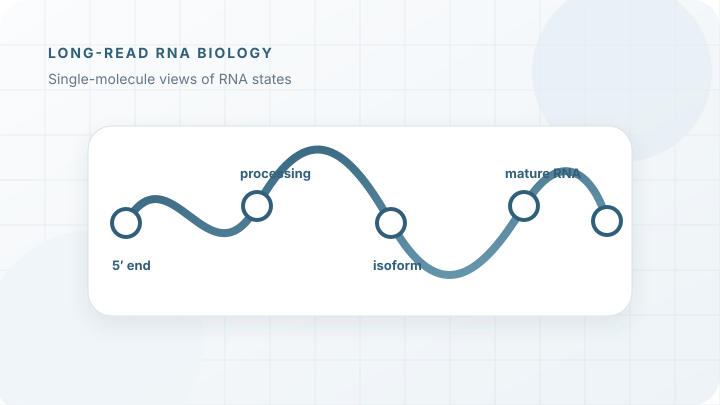
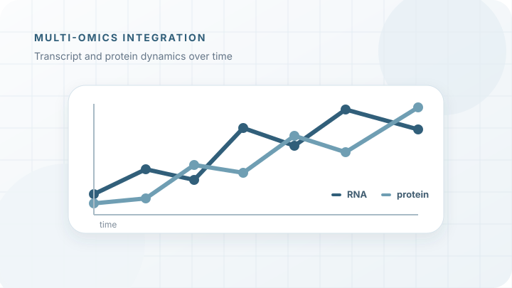
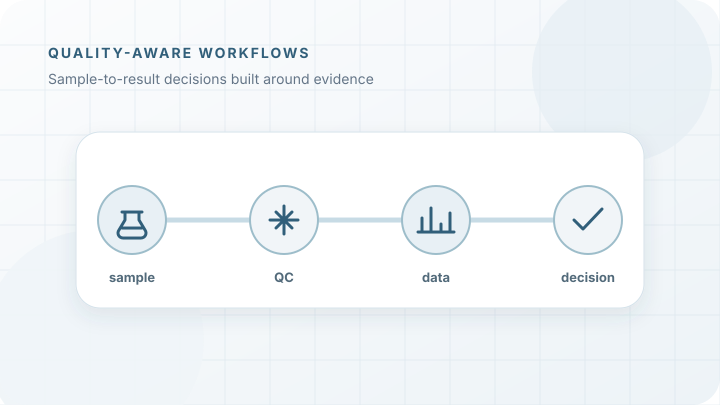
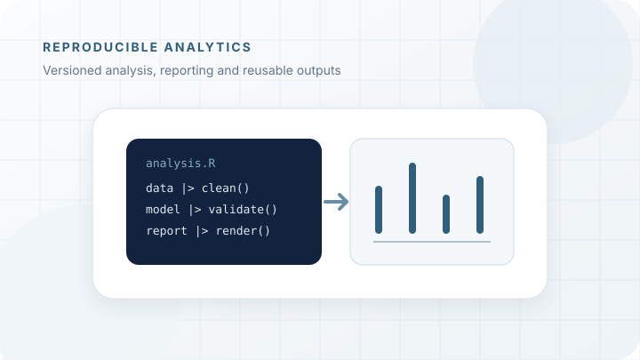
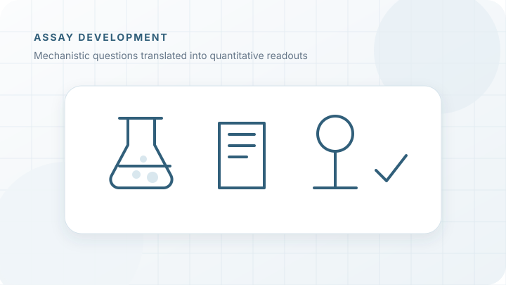

::: {.page-hero}

SELECTED PROJECTS

# Scientific questions approached across experiments and data

These examples focus on the reasoning behind a workflow: what needed to be measured, how the method was adapted, how data quality was assessed and how the results were interpreted.
:::

::: {.light-section .content-section}
## Long-read RNA biology {#long-read-rna-biology}

::: {.case-study}
::: {.case-summary}

SINGLE-MOLECULE SEQUENCING

### Resolving RNA heterogeneity and processing

Long-read approaches make it possible to observe transcript boundaries, combinations of processing events and complete RNA intermediates on individual molecules.
:::

::: {.case-details}
**Question**  
How can single-molecule sequencing be adapted to reveal the formation and maturation of prokaryotic RNA molecules?

**Approach**  
Development and benchmarking of Nanopore RNA and cDNA workflows, including sample preparation, library strategy, depletion concepts, quality control and computational analysis.

**Contribution**  
Experimental workflow development, sequencing strategy, analysis design, visualization and interpretation across bacterial and archaeal systems.

**Outcome**  
Workflows that resolve RNA ends, processing intermediates and molecular heterogeneity beyond conventional short-read summaries.
:::
:::

## Multi-omics stress response {#multi-omics-stress-response}

::: {.case-study}
::: {.case-summary}

TRANSCRIPTOMICS × PROTEOMICS

### Following dynamic cellular responses across molecular layers

Transcript and protein abundance can change with different kinetics and reveal complementary aspects of cellular adaptation.
:::

::: {.case-details}
**Question**  
How do prokaryotic cells coordinate transcriptional and translational responses during environmental stress and recovery?

**Approach**  
Time-resolved transcriptomics and proteomics, supported by transcript-boundary mapping, statistical modelling and integrated visualization.

**Contribution**  
Study design, sequencing strategy, statistical evaluation, multi-omics integration and reconstruction of regulatory responses.

**Outcome**  
A time-resolved view of stress adaptation distinguishing immediate transcriptional regulation from delayed protein-level responses.
:::
:::

## Quality-aware molecular workflows {#quality-aware-workflows}

::: {.case-study}
::: {.case-summary}

SAMPLE QC × WORKFLOW EVALUATION

### Designing workflows around data quality and practical use

A technically successful run is not enough if sample quality, method fit, documentation and downstream interpretation are not considered together.
:::

::: {.case-details}
**Question**  
How can sequencing and molecular workflows be evaluated before they are used for difficult samples or collaborative applications?

**Approach**  
Assessment of sample purity and integrity, input requirements, library strategies, expected coverage, controls, data handover and routine-use risks.

**Contribution**  
Technical consultation, workflow planning, sample-QC assessment, troubleshooting, data interpretation and methods documentation across academic and industry collaborations.

**Outcome**  
Clearer go/no-go decisions, more realistic experimental expectations and traceable handover from sample preparation to analysis.
:::
:::

## Reproducible analytical workflows {#reproducible-analytical-workflows}

::: {.case-study}
::: {.case-summary}

R × QUARTO × WORKFLOW AUTOMATION

### Making complex analyses reusable and communicable

An analysis is most useful when its assumptions, transformations and outputs remain understandable after the first result has been generated.
:::

::: {.case-details}
**Question**  
How can data-intensive projects remain transparent while datasets, collaborators and analytical questions evolve?

**Approach**  
Modular R analysis, version control, parameterized reporting, reusable visualizations and structured computational pipelines.

**Contribution**  
Development of analysis templates, automated reports, dashboards and documented project structures used across collaborative projects.

**Outcome**  
Faster iteration, clearer quality checks and more consistent communication between experimental and computational contributors.
:::
:::

## Molecular and biochemical assay development

::: {.case-study}
::: {.case-summary}

MOLECULAR BIOLOGY × BIOCHEMISTRY

### Translating mechanistic questions into measurable assays

Experimental systems are most useful when readouts, controls and analytical limits are designed around the biological question.
:::

::: {.case-details}
**Question**  
How can transcriptional, translational and protein-level mechanisms be tested in controlled experimental systems?

**Approach**  
Cloning, recombinant protein expression and purification, in vitro workflows, plate-reader assays, qPCR and complementary biophysical measurements.

**Contribution**  
Assay design, method establishment, optimization, quantitative evaluation and supervision of experimental implementation.

**Outcome**  
Practical experimental systems connecting molecular mechanisms with quantitative and reproducible readouts.
:::
:::
:::
